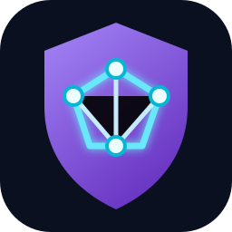
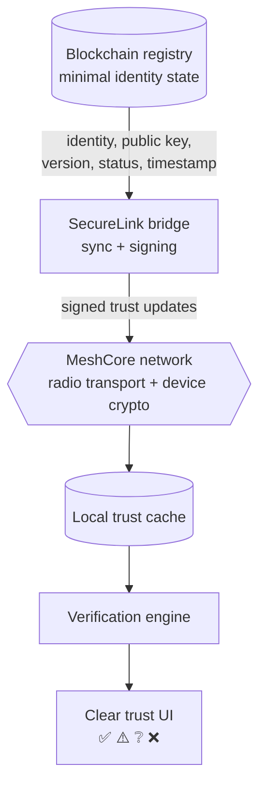

  

<h1 align="center">SecureLink</h1>

  <strong>A decentralized trust layer for intermittently connected MeshCore networks.</strong>

  
  
  

---

## The idea

MeshCore already provides mesh communication and device cryptography. SecureLink does **not** alter its firmware or rebuild its cryptography. Instead, it adds a companion-layer trust system that helps people answer a practical question:

> Is this mesh node currently trusted—even when the Internet and blockchain are unavailable?

SecureLink maintains a minimal decentralized identity registry, distributes signed trust updates through bridges and the mesh, and lets nodes make clear, offline-aware verification decisions from their local trust cache.

## Trust at a glance

| Status | Meaning | User-facing signal |
| :---: | --- | --- |
| ✅ **Verified** | Registered and current trust information is available. | Safe to identify |
| ⚠️ **Stale** | Previously verified, but the cached state may be out of date. | Verify with caution |
| ❔ **Unknown** | No trusted registration is available locally. | Not yet verified |
| ❌ **Revoked** | The latest known registry state revokes the identity. | Do not trust |

## Architecture

### What belongs on-chain

| Stored | Never stored |
| --- | --- |
| Node identity and public key | Messages and chat content |
| Key version and lifecycle status | Radio traffic |
| Registration, rotation, revocation timestamps | Private keys |

## Research question

**How can decentralized identity verification improve trust management in intermittently connected MeshCore networks without modifying the underlying mesh firmware?**

SecureLink evaluates three dimensions:

- **Security:** impersonation, key substitution, revocation, altered trust data, replayed updates, and compromised identities.
- **Availability:** offline operation, stale caches, disconnected bridges, reconnection, and conflicting updates.
- **Usability:** explaining verified identity without requiring users to compare cryptographic keys.

## Proposed stack

  
  
  
  
  

## Repository contents

| File | Purpose |
| --- | --- |
| `Decentralized Key Transparency Research.pdf` | Background research and evidence base. |
| `SecureLink_Decentralized_Key_Transparency.pptx` | Project presentation. |
| `build_hamza.py` / `build_pptx.py` | Presentation-generation sources. |
| `gen_assets.py` | Assets used by the presentation build. |

## Planned build path

1. Define the SecureLink identity and signed trust-update formats.
2. Build the minimal registration, key rotation, and revocation registry.
3. Implement a bridge that syncs registry state into an offline local cache.
4. Connect the bridge to MeshCore through its Companion Protocol.
5. Test trust decisions during offline, stale, replay, and revocation scenarios.
6. Present results through the four simple trust states above.

## Core principle

> **MeshCore is the ground layer. SecureLink is the decentralized trust layer above it.**

---

Built as a security and distributed-systems semester project.

